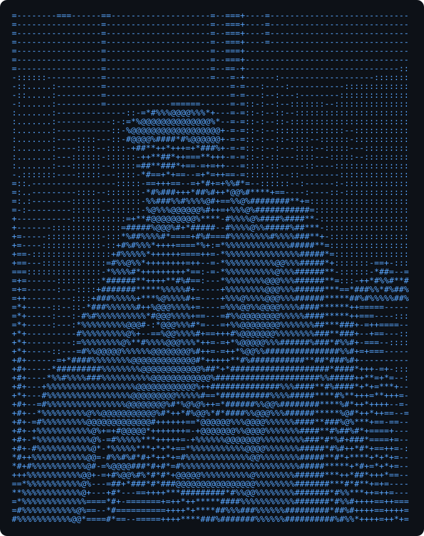
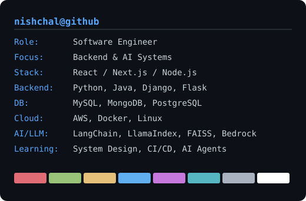

<!-- hero: monochrome ASCII portrait beside a neofetch-style info panel.
     regenerate portrait: python scripts/make_ascii_svg.py assets/photo.jpg -o avi-ascii.svg
     regenerate info card: python scripts/make_info_card.py -o info-card.svg -->
<!-- animated contribution graph: real data pulled from the GitHub GraphQL API
     (regenerated daily by .github/workflows/update-profile-art.yml) -->

<h3><code>nishchal@github ~ $ ./contributions.sh</code></h3>

 
 

<h3><code>nishchal@github ~ $ whoami</code></h3>
<table>
<tr>
<td valign="top"></td>
<td valign="top"></td>
</tr>
</table>

 
 

<h3><code>nishchal@github ~ $ ./links.sh</code></h3>

<b>Software Engineer · Backend & AI Systems · Cloud & Scalable Applications</b>

 

---

<h3><code>nishchal@github ~ $ cat about.md</code></h3>

I'm a Software Engineer with experience across frontend, backend, AI systems, and cloud-native applications. I enjoy building scalable and maintainable software with a strong focus on clean architecture, efficient backend systems, performance optimization, developer experience, and end-to-end product ownership.

I work across the stack — from APIs and databases to frontend interfaces and deployment pipelines.

---

<h3><code>nishchal@github ~ $ ./stack.sh</code></h3>

**Frontend**

**Backend & Databases**

**Cloud / DevOps / Tools**

**AI / LLM Engineering**

LangChain • LlamaIndex • FAISS • RAG Pipelines • Amazon Bedrock • OpenAI APIs

---

<h3><code>nishchal@github ~ $ ls projects/</code></h3>

| Project | Description | Stack |
|---|---|---|
| 🚘 SmartRide Manager | Bike maintenance tracking app | React Native, Firebase |
| 🤖 J.A.D.E | AI assistant for automation | Python |
| 📄 Chat With PDF | RAG PDF chatbot using FAISS + Claude | Bedrock, LangChain |
| 🔗 IPFS IMG Upload | Secure image uploader using IPFS | JavaScript, Web3 |
| 🧠 EDUBot | AI-powered learning chatbot | Python |
| 🌐 Portfolio | Personal developer portfolio | HTML, CSS, JS |

---

<h3><code>nishchal@github ~ $ cat stats.md</code></h3>

  
   
  

  

---

<h3><code>nishchal@github ~ $ cat learning.md focus.md</code></h3>

**Currently learning:** Scalable frontend architecture · System design for engineers · Docker & CI/CD pipelines · Advanced TypeScript patterns · AI agent systems

**Ask me about:** React & Next.js · Backend engineering · AI/LLM systems · Cloud-native applications · Frontend performance · API architecture · Clean code practices

---

<i>90% coding, 10% wondering why it worked 🤝</i>
 
<b>✨ Code • Build • Scale • Repeat ✨</b>

